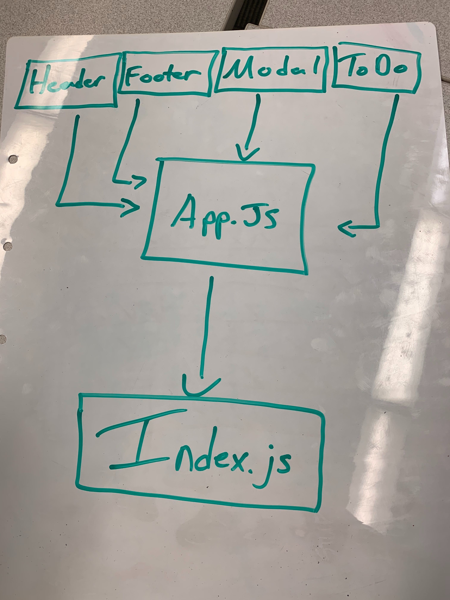

# 401-lab-31

## To Do with hooks

[CI](https://github.com/david-vloedman/401-lab-31/actions)

[Deployment](https://csb-sxb9j.netlify.com/)

[Code Sandbox](https://codesandbox.io/s/401-lab-31-sxb9j)

## Setup

* dev-build - npm start
* test - npm test

## UML

